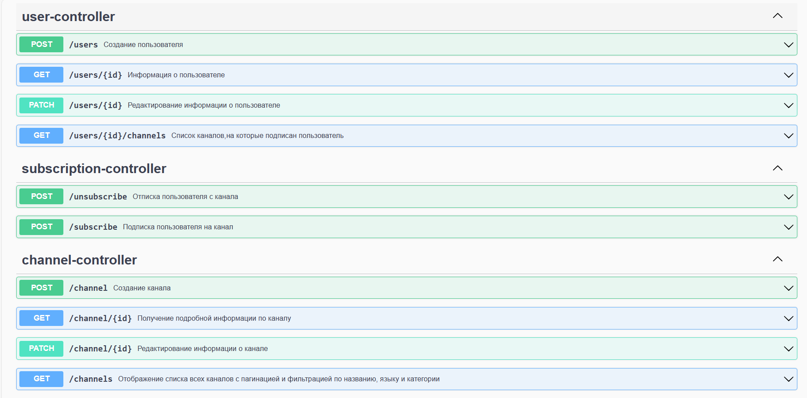

## Использование
Для документирования проекта использовалась спецификация OpenAPI 3.0 и SwaggerUI.

## Условия задания

### Написать REST веб-сервис для работы с каналами видеохостинга на Spring Boot
Описание предметной модели:
* Канал: канал имеет название, краткое описание, автора (среди зарегистрированных пользователей), неограниченное число подписчиков (тоже среди зарегистрированных пользователей), дату создания, один основной язык, аватарку, одну категорию
* Пользователь : каждый пользователь имеет никнейм, имя, почту и может подписаться на неограниченное число каналов

### Необходимые операции:
- создание и редактирование информации о пользователе
- создание и редактирование информации о канале
- подписка пользователя на канал
- отписка пользователя с канала
- отображение списка всех каналов с пагинацией и фильтрацией по названию, языку и категории.
  список должен содержать название, количество подписчиков, язык, аватарку, категорию
- отображение списка всех подписок пользователя (без пагинации)
  список должен содержать только название каналов
- получение подробной информации по каналу (все, что в списке + описание, автор, дата создания)

### Требования:
- соблюдать принципы REST
- запросы должны оперировать идентификаторами сущностей при необходимости (например, при получении подробной инфы по каналу требуется на входе иметь его идентификатор)
- должна быть реализована удобная обработка исключительных ситуаций (например, не найден канал, на который пытаются подписаться). Запросы должны возвращать сообщение об ошибке и подходящий http статус
- схема базы данных должна создаваться при помощи средств миграции (flyway или liquibase)

### Требования к используемым технологиям:
- Java 17
- Spring Boot 3.0+
- Gradle
- PostgreSQL
- JPA
- Spring Data Repositories
- Lombok
- MapStruct
- активно используем Java Streams